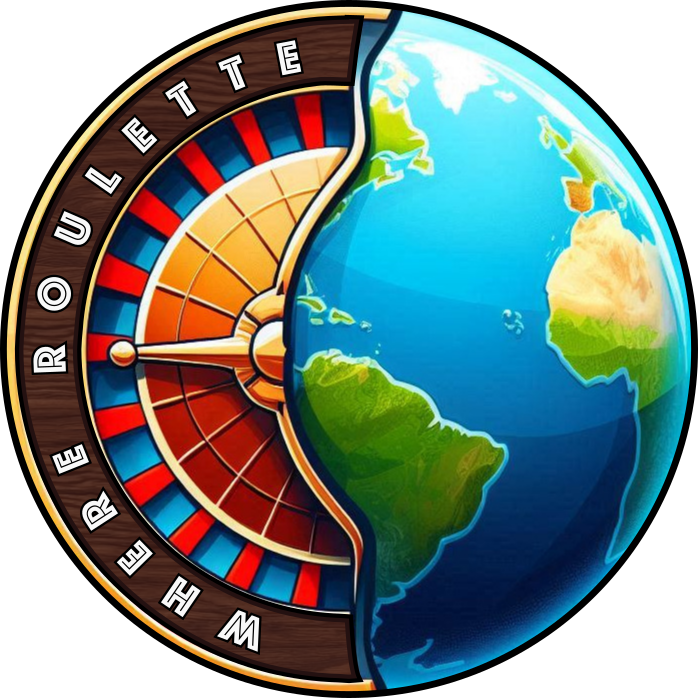

# WhereRoulette 💻🎰🌍

**[https://whereroulette.com](https://whereroulette.com)**



WhereRoulette is a web application designed to randomly select a [point of interest](https://wiki.openstreetmap.org/wiki/Points_of_interest) (POI) within a specified area. This tool solves the problem of choosing a place to go when you need somewhere to meet with friends, but the specific location isn't that important.

## Features

- Choose a [POI](https://wiki.openstreetmap.org/wiki/Points_of_interest) randomly in a region specified by:
  - District name
  - Central point and a radius
  - Bounding box
  - The equidistance between your and your friends' locations
- Encode your location into a URL to quickly share with friends and find "somewhere in the middle."
- Quickly filter POIs for bars, restaurants, or cafes.
- Subcategory filters for when you're more picky about where you want to go.
- Access information about each POI through map interactions.
- Share the selected location via a URL with encoded data.
- **SPIN THE WHEEL** animation + sound effects 🎰

## Powered By Open Data

The application heavily relies on open data from [OpenStreetMap](https://www.openstreetmap.org/about).

## External Libraries and Resources

WhereRoulette uses several external libraries and resources:

- **[Nominatim](https://nominatim.openstreetmap.org/ui/about.html)** for geocoding
- **[Overpass API](https://wiki.openstreetmap.org/wiki/Overpass_API)** for serving OpenStreetMap data
- **[Maplibre-gl](https://maplibre.org/)** for rendering interactive maps
- **[Maplibre-gl-directions](https://maplibre.org/maplibre-gl-directions)** for directions
- **[osmtogeojson](https://github.com/tyrasd/osmtogeojson)** for converting OpenStreetMap data to GeoJSON
- **[FontAwesome](https://fontawesome.com/)** for icons
- **[Webpack](https://webpack.js.org/)** for bundling assets
- **[Umami](https://umami.is/)** for privacy-focused analytics
- **[Postgres](https://www.postgresql.org/)** for storing analytics data

## Development

### Project Structure

The project is structured as follows:

- `app/`: Webapp.
- `.github/`: CI config.
- `.env`: Variables to be set as secrets.

### Frontend

To serve the webapp frontend locally, navigate to the `app/` directory, install the requirements, and run a development server:

```bash
cd app/
npm install
npm run serve
```

The site should now be served on [`http://localhost:8080/`](http://localhost:8080/).

To bundle the frontend, change into the `app/` directory and run the build command:

```bash
cd app/
npm install
npm run build
```

## API 🚀

WhereRoulette provides a simple API using Netlify Edge Functions to retrieve POIs within a specified region. Mix some randomness into your apps or get details about specific locations! ✨

### POI Endpoint ⚡

```bash
GET https://whereroulette.com/api
```

#### Query Parameters 🔍

| Parameter | Description | Required | Default |
|-----------|-------------|----------|---------|
| region    | OpenStreetMap region ID | Yes | - |
| type      | POI category (drinks, cafe, food, park, climb) | No | drinks |
| id        | Specific OSM node ID (e.g., "node/11967421222" or just "11967421222") | No | - |

#### Usage Examples 📝

**Random POI:**

```bash
https://whereroulette.com/api?region=62422&type=climb
```

**Specific POI by ID:**

```bash
https://whereroulette.com/api?region=62422&type=climb&id=node%2F11967421222
```

#### Response Example 💾

```json
{
  "osm_node": "11967421222",
  "name": "Bouldergarten",
  "type": "climb",
  "emoji": "🧗",
  "opening_hours": "Mo-Fr 10:00-23:00, Sa,Su 10:00-22:00",
  "url": "https://whereroulette.com/?region=62422&type=climb&id=node%2F11967421222",
  "coordinates": [13.4567, 52.4890]
}
```

#### Error Responses ⚠️

**Missing Region:**

```json
{
  "error": "Missing required parameter: region"
}
```

**Invalid Category:**

```json
{
  "error": "Invalid type. Must be one of: drinks, cafe, food, park, climb"
}
```

**No POIs Found:**

```json
{
  "error": "No climb found in region 62422"
}
```

**Node Not Found:**

```json
{
  "error": "Node with ID node/12345678 not found"
}
```

### Technical Implementation 🛠️

The API is implemented as a Netlify Edge Function, which provides fast, globally distributed response times. It directly queries the Overpass API to fetch OpenStreetMap data and converts it to a simplified format optimized for POI information.

The configuration in `netlify.toml` maps the `/api` path to the Edge Function:

```toml
[[edge_functions]]
function = "json"
path = "/api"
```

## Deployment

### Frontend - GitHub Pages

The site is hosted using [GitHub Pages](https://pages.github.com/). A GitHub action bundles the site and deploys all content in the `app/dist` subdirectory for the `main` branch.

The site gets deployed to [https://whereroulette.com](https://whereroulette.com).

### Analytics

The site uses [Umami](https://umami.is/) for privacy-focused analytics.

An instance is hosted on [fly.io](https://fly.io). The configuration is defined in the [analytics](https://github.com/01100100/analytics) repository.

A DNS record is set up such that the `stats.whereroulette.com` subdomain points to the Umami instance.

The analytics script is available at [https://stats.whereroulette.com/script.js](https://stats.whereroulette.com/script.js), which is downloaded and stored in this repository in `src/assets/analytics.js`.

Webpack is configured to include the analytics script in the build and it is used in the `index.html` file.

To update the script, run the following command:

```bash
curl https://stats.whereroulette.com/script.js -o src/assets/analytics.js
```

## Shoutouts

Thanks to Casper Ashdown ([github.com/surelybassy](https://github.com/surelybassy)) for creating a amazing logo!
